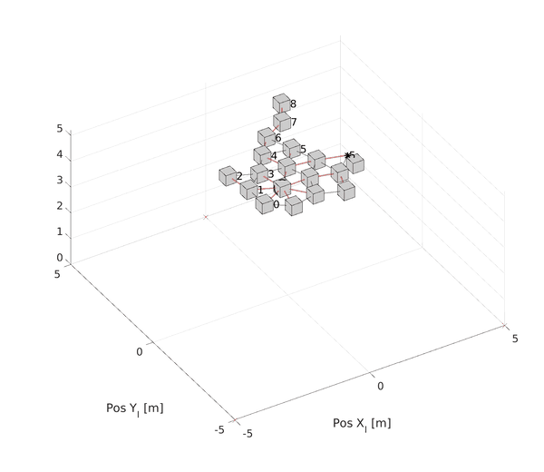

# AuctionOrdering

> **Note:** All code in this repository was written by Kleber Cabral. The README documentation and inline code comments were added with AI assistance (Claude).

Code for the **2023 IEEE SysCon** paper "Auction-based solution for the ordering problem
in robotic self-assembly", by Kleber M. Cabral, Jefferson Silveira Jr., Peter T. Jardine,
and Sidney N. Givigi Jr. A standalone companion to the
`SelfAssembly` repo.

**Paper:** [doi:10.1109/SysCon53073.2023.10131207](https://doi.org/10.1109/SysCon53073.2023.10131207) ·
**Slides:** [presentation/SysCon2023_slides.pdf](presentation/SysCon2023_slides.pdf)

*A simulated assembly run, animated from the frames in `src/Auction/video/`.*

## What it does

Robots arriving at a self-assembly site need to be ordered/sequenced. This work proposes
an auction-based mechanism for that ordering problem and compares it against a random
baseline, with and without battery-aware cost terms, across simulated multi-agent
assembly experiments. A real-hardware hexapod flocking controller and a Simulink model
for real-UAV validation are also included.

## Structure

- `src/` — MATLAB/Python source:
  - `Auction/` — the auction-based cost/selection logic (`cost_based_selection*.m`),
    experiment rerun/plotting scripts, and `video/` (342 frame-by-frame PNGs from a
    simulated assembly run).
  - `controller.py` — a ROS flocking controller used for hexapod hardware.
  - `simulate_agents_pos.m`, `experiments.m`, `experiments100.m`,
    `statistical_analysis.m` — simulation and batch-experiment drivers.
- `real_uavs/auction_with_real_uavs.slx` — Simulink model for real-UAV auction-ordering
  validation.
- `data/` — experiment `.mat` outputs (random vs. auction, with/without battery decay);
  `src/statistical_analysis.m` and `src/Auction/rerun_experiments.m` load from here.
- `figures/` — paper figure sources (`.odg`/`.png`/`.pdf`/`.fig`), including a `thesis/`
  subfolder of figure variants used in the PhD thesis.
- `statistical_analysis/` — the paper's statistical comparison package (rank-sum/t-test
  MATLAB Live Scripts, with their own copies of the relevant experiment `.mat` files so
  they run standalone).
- `presentation/SysCon2023_slides.pdf` — the conference talk slides.

## Not included

An exploratory RL-based task-assignment variant (rhoSMDP) is not part of this repo: it
doesn't match the paper's published method and bundles third-party code.

## Key dependencies

MATLAB, Python 3 with ROS (for `controller.py`).

## Status

Paper code (SysCon 2023) — archival, not actively maintained.
